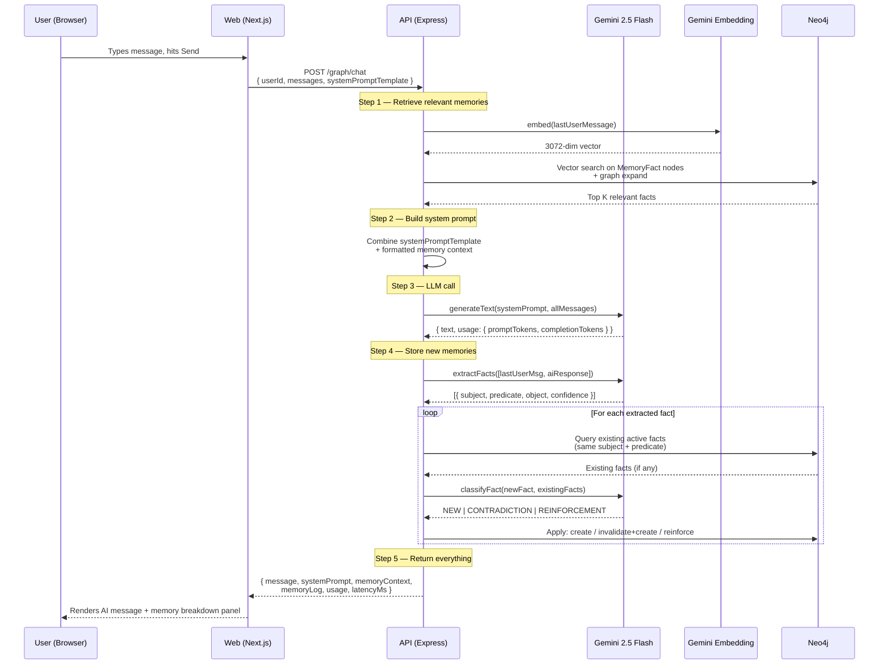
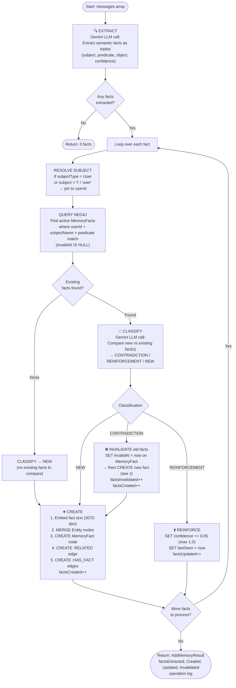
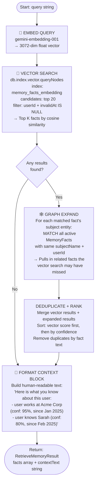
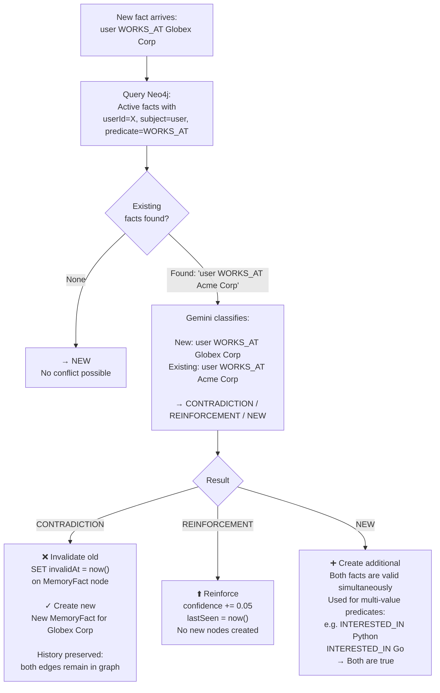

# memory-soda — Architecture & Flow

## Table of Contents

1. [System Overview](#1-system-overview)
2. [Tech Stack](#2-tech-stack)
3. [Repository Structure](#3-repository-structure)
4. [End-to-End Chat Flow](#4-end-to-end-chat-flow)
5. [Memory Add — Deep Dive](#5-memory-add--deep-dive)
6. [Memory Retrieve — Deep Dive](#6-memory-retrieve--deep-dive)
7. [Contradiction Detection](#7-contradiction-detection)
8. [The Knowledge Graph](#8-the-knowledge-graph)
9. [API Reference](#9-api-reference)

---

## 1. System Overview

memory-soda is a **semantic memory layer for AI agents**. It sits between your application and your LLM, maintaining a structured knowledge graph about each user. Every conversation is mined for facts, those facts are stored with embeddings and relationships, and before each LLM call the most relevant facts are retrieved and injected into the system prompt — making the agent feel like it genuinely remembers the user.

```
┌──────────────────────────────────────────────────────────────┐
│                    Your AI Application                        │
│                                                              │
│   const memory = new MemorySodaClient({ apiKey, baseUrl })   │
│                                                              │
│   // Before LLM call                                         │
│   const ctx = await memory.retrieve(userId, userMessage)     │
│                                                              │
│   // After LLM response                                      │
│   await memory.add(userId, [userMsg, assistantMsg])          │
└──────────────────┬───────────────────────────────────────────┘
                   │  HTTP + API Key
                   ▼
┌──────────────────────────────────────────────────────────────┐
│                    memory-soda API                           │
│                  (Express / Node.js)                         │
│                                                              │
│   ┌──────────────┐   ┌──────────────┐   ┌───────────────┐   │
│   │    Gemini    │   │    Neo4j     │   │   Postgres    │   │
│   │  2.5 Flash   │   │  (Graph DB)  │   │  (API Keys)   │   │
│   │  Embedding   │   │             │   │               │   │
│   │    001       │   │             │   │               │   │
│   └──────────────┘   └──────────────┘   └───────────────┘   │
└──────────────────────────────────────────────────────────────┘
```

---

## 2. Tech Stack

| Layer               | Technology                      | Why                                          |
| ------------------- | ------------------------------- | -------------------------------------------- |
| API server          | Express + Node.js               | Lightweight, fast, familiar                  |
| Graph database      | Neo4j 5.18                      | Native graph traversal, vector index support |
| Relational database | Postgres + Drizzle ORM          | API key management, typed schema             |
| LLM                 | Gemini 2.5 Flash                | Fast, cheap, good at structured extraction   |
| Embeddings          | gemini-embedding-001 (3072-dim) | Semantic similarity for fact retrieval       |
| SDK                 | TypeScript, native fetch        | Zero dependencies, works in any Node.js app  |
| Dev console         | Next.js 16 + Tailwind           | Agent builder playground                     |

---

## 3. Repository Structure

```
memory-soda/
├── apps/
│   ├── api/                    — Express API server
│   │   └── src/
│   │       ├── db/
│   │       │   ├── postgres.ts         Pool + Drizzle instance
│   │       │   ├── neo4j.ts            Neo4j driver instance
│   │       │   ├── neo4j-init.ts       Vector index + constraints setup
│   │       │   ├── schema.ts           Drizzle table definitions
│   │       │   └── migrations/         SQL migration files
│   │       ├── services/
│   │       │   ├── gemini.service.ts   LLM + embedding calls
│   │       │   ├── neo4j-memory.service.ts  Core memory algorithm
│   │       │   └── api-key.service.ts  API key CRUD
│   │       ├── routes/
│   │       │   ├── graph.ts            /graph/add, /graph/retrieve, /graph/chat
│   │       │   ├── api-keys.ts         /api-keys CRUD
│   │       │   └── health.ts           /health
│   │       ├── middleware/
│   │       │   ├── auth.ts             API key validation
│   │       │   └── validate.ts         Zod request validation
│   │       └── main.ts                 Bootstrap (migrate → neo4j init → listen)
│   │
│   └── web/                    — Next.js dev console
│       └── src/app/
│           ├── playground/     Agent builder UI
│           └── api-keys/       Key management UI
│
├── packages/
│   ├── sdk/                    — @memory-soda/sdk (npm package)
│   │   └── src/
│   │       ├── client.ts       MemorySodaClient class
│   │       ├── http.ts         Fetch wrapper
│   │       └── errors.ts       Typed error classes
│   └── types/                  — @memory-soda/types (shared types)
│
└── docker-compose.yml          — Neo4j + Postgres + Redis (local dev)
```

---

## 4. End-to-End Chat Flow

This is the full journey of a single user message through the system when using `POST /graph/chat` (the playground endpoint).



---

## 5. Memory Add — Deep Dive

`POST /graph/add` (or called internally by `/graph/chat`)

### Input

```typescript
{ userId: string, messages: Message[] }
```

### Algorithm



### The Extracted Triple Format

Every sentence in a conversation that contains factual information about the user is broken down into a **subject → predicate → object** triple:

```
"I work at Acme Corp as an engineer"
→ (user, WORKS_AT, Acme Corp)
→ (user, HAS_ROLE, Engineer)

"I've known Sarah since college"
→ (user, KNOWS, Sarah)

"I'm based in San Francisco"
→ (user, BASED_IN, San Francisco)

"I'm really into distributed systems"
→ (user, INTERESTED_IN, Distributed Systems)
```

### Entity Types

| Type           | Examples                                      |
| -------------- | --------------------------------------------- |
| `User`         | The person talking (always pinned to userId)  |
| `Person`       | Sarah, John, my manager                       |
| `Organization` | Acme Corp, Google, my team                    |
| `Place`        | San Francisco, London, the office             |
| `Topic`        | Distributed Systems, Python, Machine Learning |
| `Concept`      | Dark mode, remote work, agile                 |
| `Value`        | Raw values like numbers, dates, free text     |

---

## 6. Memory Retrieve — Deep Dive

`POST /graph/retrieve`

### Input

```typescript
{ userId: string, query: string, limit?: number }
```

### Algorithm



### Why Two Steps (Vector + Graph)?

**Vector search alone** finds semantically similar facts but can miss related context. For example:

- Query: `"what does the user do for work?"`
- Vector search finds: `"user works at Acme Corp"` ✓
- But misses: `"user is an engineer"`, `"user manages a team"` — also relevant but less similar to the query string

**Graph expansion** fetches all active facts for the matched entity, catching those related facts regardless of semantic distance.

---

## 7. Contradiction Detection

When a new fact has the same **subject + predicate** as an existing fact, a second Gemini call decides what to do.



### Bi-temporal Records

We **never delete** facts. Every invalidated fact has both `validAt` and `invalidAt` set, so you can query the state of the graph at any point in time:

```cypher
-- What did we know about this user on March 1st?
MATCH (f:MemoryFact)
WHERE f.userId = 'alice'
  AND f.validAt <= '2025-03-01T00:00:00Z'
  AND (f.invalidAt IS NULL OR f.invalidAt > '2025-03-01T00:00:00Z')
RETURN f
```

---

## 8. The Knowledge Graph

### Node Labels

```
(:User) — not explicitly created; userId is a property on facts/entities
(:Entity { id, name, type, userId })
(:MemoryFact { id, userId, text, predicate, subjectName, subjectType,
               objectName, objectType, embedding, confidence,
               validAt, invalidAt })
```

### Relationship Types

```
(:Entity)-[:RELATED { predicate, factId, confidence, validAt, invalidAt }]->(:Entity)
(:Entity)-[:HAS_FACT]->(:MemoryFact)
```

### Example Graph

After a user says: _"I work at Acme Corp, I know Sarah who's also an engineer there, and I'm based in San Francisco"_

```
(user:Entity {type:User})
    │
    ├──[RELATED: WORKS_AT]──► (acme:Entity {name:"Acme Corp", type:Organization})
    │
    ├──[RELATED: KNOWS]──────► (sarah:Entity {name:"Sarah", type:Person})
    │                               │
    │                               └──[RELATED: WORKS_AT]──► (acme)
    │
    └──[RELATED: BASED_IN]───► (sf:Entity {name:"San Francisco", type:Place})
```

### Vector Index

Each `MemoryFact` node has an `embedding` property — a 3072-dimensional float vector generated by `gemini-embedding-001`. Neo4j maintains a vector index (`memory_facts_embedding`) over this property, enabling approximate nearest-neighbour search with cosine similarity.

---

## 9. API Reference

### Public Endpoints (no auth)

| Method   | Path              | Description                                 |
| -------- | ----------------- | ------------------------------------------- |
| `GET`    | `/health`         | Service health (Postgres, Neo4j, Redis)     |
| `GET`    | `/api-keys`       | List all API keys                           |
| `POST`   | `/api-keys`       | Create an API key `{ name }`                |
| `DELETE` | `/api-keys/:id`   | Revoke an API key                           |
| `POST`   | `/graph/chat`     | Full playground turn (retrieve → LLM → add) |
| `POST`   | `/graph/add`      | Extract + store facts from messages         |
| `POST`   | `/graph/retrieve` | Retrieve relevant facts for a query         |

### Protected Endpoints (require `Authorization: Bearer <key>`)

Currently none — graph routes are public for the dev console POC. SDK-facing routes will be added here as the product matures.

### `/graph/chat` Request / Response

```typescript
// Request
{
  userId: string
  messages: { role: 'user' | 'assistant', content: string }[]
  systemPromptTemplate?: string   // optional custom base prompt
}

// Response
{
  message: string                 // AI response text
  systemPrompt: string            // Full system prompt sent to LLM (with memory injected)
  memoryContext: ContextFact[]    // Facts that were retrieved and injected
  memoryLog: MemoryOperationStep[] // Every memory operation that ran
  usage: {
    promptTokens: number
    completionTokens: number
    totalTokens: number
  }
  latencyMs: number
}
```

### `/graph/add` Request / Response

```typescript
// Request
{
  userId: string
  messages: { role: 'user' | 'assistant', content: string }[]
}

// Response
{
  result: {
    userId: string
    factsExtracted: number
    factsCreated: number
    factsUpdated: number
    factsInvalidated: number
    log: MemoryOperationStep[]
  }
}
```

### SDK Usage

```typescript
import { MemorySodaClient } from '@memory-soda/sdk';

const memory = new MemorySodaClient({
  baseUrl: 'https://your-api.example.com',
  apiKey: 'ms_...',
});

// In your agent loop:
const context = await memory.retrieve(userId, userMessage);
const systemPrompt = `You are a helpful assistant.\n\n${context.contextText}`;

const aiResponse = await yourLLM.chat(systemPrompt, messages);

await memory.add(userId, [
  { role: 'user', content: userMessage },
  { role: 'assistant', content: aiResponse },
]);
```
